  
  

  

 

  

    Hi there!  I'm a software engineer who thrives on complexity.  
    I don't just write code; I craft <b>solutions</b>. From full-stack web apps to machine learning models,  
    I focus on performance, scalability, and clean architecture.
  

 
  
  &nbsp;
  
  &nbsp;
  

  

### 
🛠️ The Arsenal

  
   
  
   
  

  

### 
📊 The Data

  <!-- 
    NOTE: The image below (github-metrics.svg) is generated by the GitHub Action defined in 
    .github/workflows/metrics.yml. It will appear after the first successful run of the action.
    This replaces the unreliable external URL with a high-quality, reliable, self-hosted image.
  -->
  
   
  
   
  

  

  

