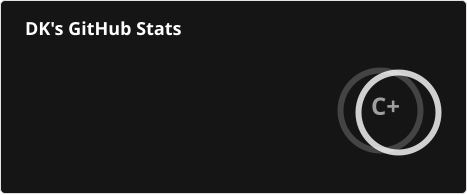
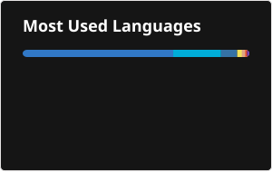
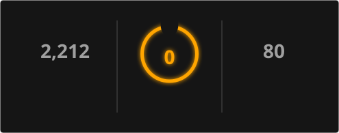

<div align="center">


</div>

```
┌─ dk@terminal ──────────────────┐
 $ whoami
 Software engineer who thrives
 on complexity.

 $ cat mission.txt
 Crafting scalable, clean,
 performant solutions — from
 full-stack apps to ML models.
└─────────────────────────────────┘
```

---

<div align="center">

<a href="https://achmdndy.dev"></a>
<a href="mailto:achmdndy@gmail.com"></a>
<a href="https://www.linkedin.com/in/achmdndy/"></a>

</div>

---

### `$ ls arsenal/`

<div align="center">


<br/>


<br/>


<br/>


</div>

---

### `$ cat stats.log`

<!--
  stats.svg / top-langs.svg / streak.svg di-generate oleh GitHub Action
  (.github/workflows/metrics.yml). Agar hitam-putih murni, set di config action:
  title_color=ffffff&text_color=ffffff&icon_color=ffffff&bg_color=000000&border_color=ffffff
-->
<div align="center">


<br/>

</div>

---
